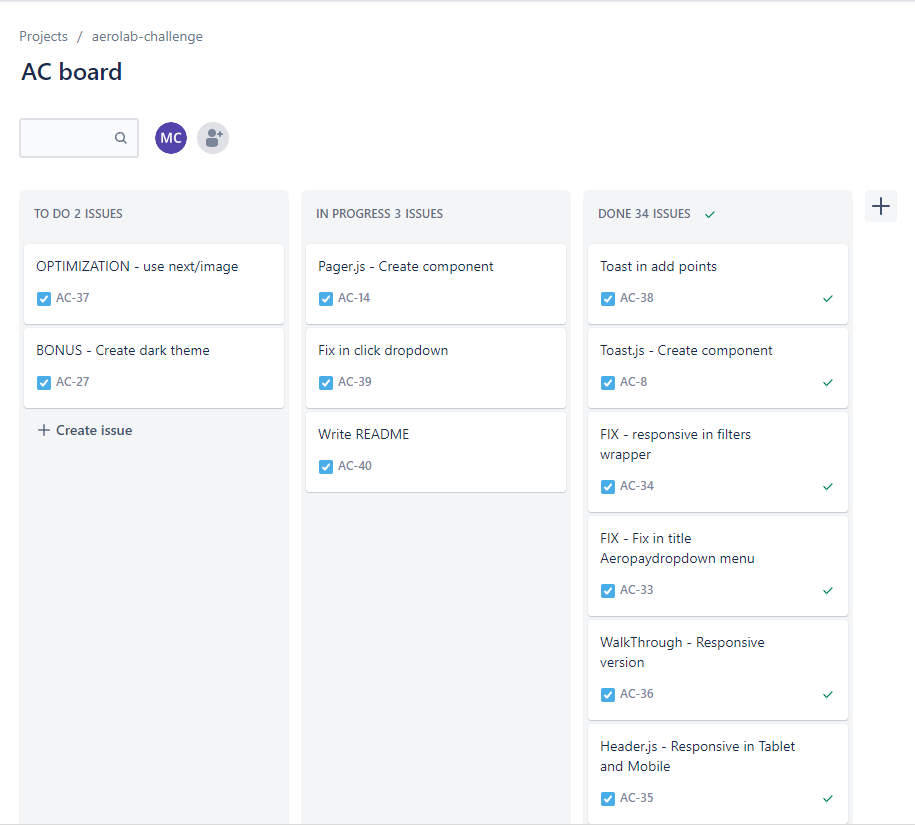
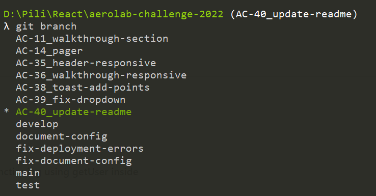
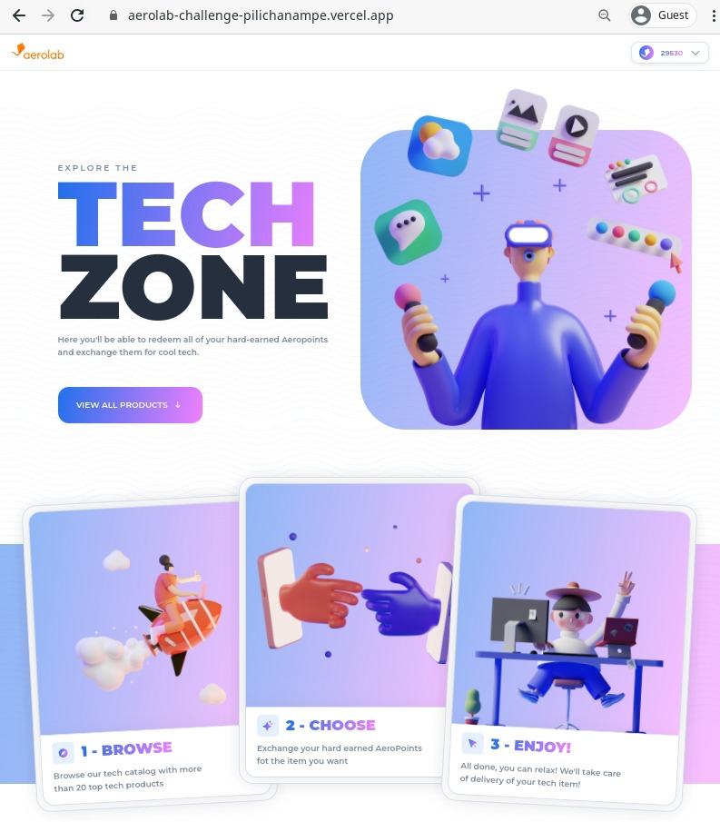

# Aerolab Challenge 2022

Proyecto desafío de front end lanzado en 2022 por la compañía de diseño digital Aerolab.

* [Enlace al desafío](https://github.com/Aerolab/frontend-developer-coding-challenge).
* [Enlace a la demo](https://aerolab-challenge-pilichanampe.vercel.app/).

## Historia de este proyecto

Aunque se podía elegir utilizar las tecnologías que nos quedaran más cómodas, decidí salir un poco de mi zona de confort (Vue.js) y me aventuré a armarlo con las tecnologías recomendadas: Next.js, Styled Components y Vercel.

Como me faltaba práctica en ellas, el primer approach fue crear un tablero de Jira para poder organizar cómo iba a ser el paso a paso, desde la configuración del stack tecnológico, hasta la transferencia del [sistema de diseño de Figma](https://www.figma.com/file/3O7BxHFnSSawJeny3lXWkE/Aerolab-Frontend-Developer-Coding-Challenge---Public?node-id=52%3A1106) a componentes de React.

Esto me permitió poder tener un control más prolijo de la creación de ramas en el repo, ya que cada tarea era una rama de Git, utilizando el prefijo que automáticamente arma el tablero.

En las primeras tareas me centré en investigar sobre las tecnologías, escudriñar completamente el Figma para determinar cómo iban a ser los componentes en el código, buscando poder reutilizar la mayor cantidad de código posible. Concebirlo al proyecto desde un principio con esa perspectiva, me ayudó a que la implementación de los componentes sea más fluida.

El primer gran desafío fue poder configurar de manera global el manejo del theme. Como en proyectos anteriores venía utilizando Vuetify (Vue.js) y me fascinaba la manera en cómo accedía a las configuraciones de estilos a través de variables accesibles a todo el proyecto, busqué una alternativa similiar y terminé llegando a Styled System, una librería que permite trabajar tranquilamente junto a Styled Components.

Teniendo en cuenta que no había utilizado mucho React, el siguiente desafío fue poder unificar el manejo de la data con los hooks, las peticiones y los métodos de SSR de Next.js.

Finalmente, al deployar el proyecto en Vercel, fue duro ver romperse todos los estilos sin piedad (T.T). Ahí es cuando me di cuenta que faltaba un pequeño gran detalle en la configuración del `_document.js` y la instalación de un plugin de Babel para que Styled Components pudiera renderizar correctamente.

Fue una experiencia muy gratificante, ya que me dio la oportunidad de poder convertir a código un bellísimo sistema de diseño armado por diseñadores profesionales, mientras aprendía a utilizar tecnologías nuevas para mí.

Aquí [se puede ver la demo](https://aerolab-challenge-pilichanampe.vercel.app/). ¡A seguir aprendiendo!

